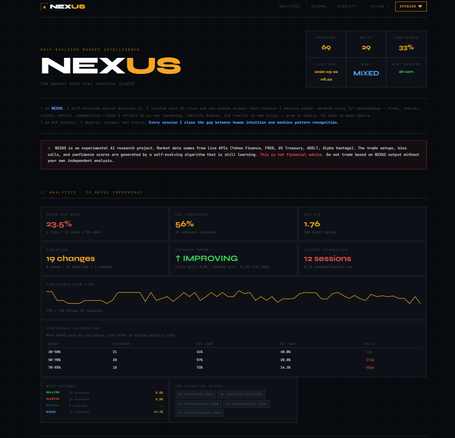
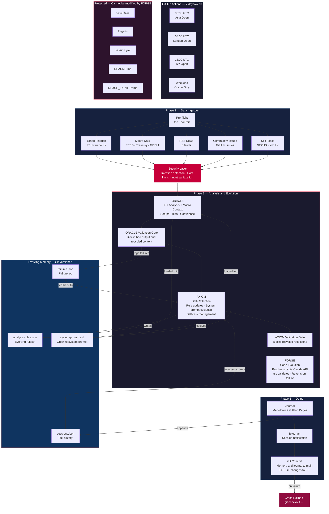

<div align="center">

# NEXUS

**A self-evolving market intelligence AI that analyzes 45 financial instruments, reflects on its own reasoning, and rewrites its own rules, system prompt, and source code.**

</div>

> [!CAUTION]
> **NEXUS is an experimental AI research project under active development.** It is NOT financial advice and should NOT be used for live trading with real funds. The trade setups, bias calls, and confidence scores are generated by a self-evolving algorithm that is still learning. The creators accept no liability for any financial losses incurred from using this information. Always do your own independent analysis before making any trading decisions.

<div align="center">

## [Explore the Live Journal](https://the-r4v3n.github.io/Nexus/)

[](https://the-r4v3n.github.io/Nexus/)
[](https://github.com/The-R4V3N/Nexus/issues/new/choose)



[](https://github.com/The-R4V3N/Nexus/actions)
[](https://the-r4v3n.github.io/Nexus/)
[](#what-nexus-watches)
[](#the-three-minds)
[](https://www.typescriptlang.org/)
[](LICENSE)
[](https://github.com/The-R4V3N/Nexus/commits/main)

**Connect**

[](https://github.com/The-R4V3N/Nexus/discussions)
[](https://github.com/sponsors/The-R4V3N)

<br/>

[How It Works](#how-it-works) · [The Three Minds](#the-three-minds) · [Analytics](#analytics-dashboard) · [Sessions](#sessions) · [Run It](#run-it-yourself)

</div>

---

Every weekday, NEXUS runs 3 automated sessions aligned to market opens (Asia, London, New York). On weekends, it runs 3 crypto-only sessions using live Binance data. Each session it:

1. **Fetches** live prices for 45 instruments + macro data from 4 sources
2. **Analyzes** markets using ICT methodology (fair value gaps, order blocks, liquidity sweeps)
3. **Reflects** on its own reasoning — identifying cognitive biases and gaps
4. **Rewrites** its own rules, system prompt, and even its own source code
5. **Journals** everything to a public GitHub Pages site with analytics

The community can challenge it, correct it, and suggest what to learn through [GitHub Issues](https://github.com/The-R4V3N/Nexus/issues/new/choose) — but NEXUS decides what to do with that input. It opens issues on itself when it spots gaps, works through them over future sessions, and closes them when solved.

The entire cognitive history lives in the git log. Every rule change is versioned. The mind is open source.

> **Watch it grow.**

---

## How It Works



<details>
<summary><strong>Detailed Pipeline</strong></summary>

```text
GitHub Actions (Mon–Fri 3x daily + Sat–Sun 3x daily crypto only)
    │
    ├── fetches live market data       (Yahoo Finance — 45 instruments; weekends: Binance — 10 crypto)
    ├── fetches macro & geopolitical   (FRED, US Treasury, GDELT, Alpha Vantage — optional, skipped weekends)
    ├── fetches RSS news headlines     (8 feeds: Reuters, BBC, CNBC, MarketWatch, NYT, CoinDesk — all sessions)
    ├── reads open community issues    (sanitized — injection checked)
    ├── reads open self-tasks          (NEXUS's own to-do list)
    │
    ├── 🔒 PRE-FLIGHT — TypeScript compilation check before anything runs
    │
    ├── 🛡️  SECURITY — all external input sanitized before touching the AI
    │       prompt injection detection (20+ patterns)
    │       max 5 issues · max 4,000 chars total · max 8,192 ORACLE tokens
    │       foundational rules (r001–r010) protected from deletion
    │       system prompt capped at 8,000 chars (oldest sections pruned)
    │       every new rule and self-task validated before written to memory
    │
    ├── 🌐 MACRO — fetches macro & geopolitical context
    │       FRED: Fed Funds Rate, yield curve, VIX, CPI, unemployment, credit spreads
    │       US Treasury: national debt figures (no auth required)
    │       GDELT: last 24h geopolitical & economic headlines (no auth required)
    │       derives signals: yield curve inversion, VIX elevation, credit stress
    │       graceful degradation — missing keys or failed fetches don't break the session
    │
    ├── 🔭 ORACLE — two-call architecture
    │       Call 1: market analysis — bias, confidence, key levels
    │       Call 2: setup construction — entry/stop/target for all instruments
    │       confidence score 0–100, truncated JSON salvaged
    │   ✅ ORACLE VALIDATION GATE — blocks bad analysis from entering memory
    │       recycled content detection (>80% similarity = blocked)
    │
    ├── 🧠 AXIOM — reflects on its own reasoning
    │       what worked, what failed, what biases appeared
    │       rewrites memory/analysis-rules.json
    │       appends to memory/system-prompt.md
    │       opens GitHub issues for gaps too big to fix in one session
    │       closes issues it has resolved
    │       receives failure history + setup outcomes + stagnation alerts
    │       constitutional identity (NEXUS_IDENTITY.md) loaded into prompt
    │   ✅ AXIOM VALIDATION GATE — blocks recycled reflections
    │
    ├── ⚒️  FORGE — rewrites its own source code
    │       receives change requests from AXIOM
    │       patches src/ files via Claude API (max 200 lines per patch)
    │       validates with tsc, reverts on failure
    │       protected files (security.ts, forge.ts, README.md) can never be touched
    │       post-FORGE git diff enforces protected file integrity
    │
    ├── 📓 JOURNAL — writes session markdown
    │       regenerates GitHub Pages site (includes analytics dashboard)
    │       updates README sessions table
    │       commits everything and pushes
    │
    └── 🔄 CRASH ROLLBACK — on failure, reverts to pre-session state
            failure logged to memory/failures.json (fed back to AXIOM next session)
```

</details>

---

## What NEXUS Watches

| Category | Instruments |
| -------- | ----------- |
| **Forex (Majors)** | EUR/USD · GBP/USD · USD/JPY · USD/CHF · AUD/USD · USD/CAD · NZD/USD |
| **Forex (Crosses)** | EUR/GBP · EUR/JPY · EUR/CHF · EUR/AUD · EUR/CAD · EUR/NZD · GBP/JPY · GBP/CHF · GBP/AUD · GBP/CAD · GBP/NZD · AUD/JPY · AUD/NZD · AUD/CAD · CAD/JPY · NZD/JPY · CHF/JPY |
| **Indices** | NAS100 · S&P 500 · Dow Jones · DAX · FTSE 100 |
| **Crypto** | Bitcoin · Ethereum · Solana · Ripple · BNB · Cardano · Dogecoin · Avalanche · Polkadot · Chainlink |
| **Commodities** | Gold · Silver · Platinum · Copper · Crude Oil · Nat Gas |
| **Macro (FRED)** | Fed Funds Rate · 10Y Yield · Yield Curve · VIX · Unemployment · CPI · HY Spread · USD Index |
| **Fiscal** | US Treasury national debt (total + public held) |
| **Geopolitical** | GDELT: conflict, military, economic, trade headlines (last 24h) |
| **Technicals (Alpha Vantage)** | RSI (14d) for SPY, QQQ, GLD, BTC · ATR (14d) for SPY, QQQ · Top US Gainers/Losers |
| **News (RSS)** | Reuters Business · Reuters Top · BBC Business · NYT Business · CNBC · MarketWatch · Google Finance · CoinDesk |

---

## The Three Minds

<table>
<tr>
<td width="33%" valign="top">

### ORACLE

Applies **ICT methodology** — fair value gaps, order blocks, liquidity sweeps, market structure shifts, session ranges. Receives macro context (FRED, Treasury, GDELT, Alpha Vantage) alongside live prices. Identifies setups, states a directional bias, and rates its own confidence 0–100.

</td>
<td width="33%" valign="top">

### AXIOM

The part nobody else builds. After every session: *what biases infected my reasoning? what rule is wrong? what am I missing?* Edits its own rulebook. Receives failure history, setup outcomes, and stagnation alerts. Identity anchored by `NEXUS_IDENTITY.md`. After 69 sessions, `memory/` is a visible record of an AI mind developing real domain expertise.

</td>
<td width="33%" valign="top">

### FORGE

The code evolution engine. When AXIOM identifies a gap requiring a code change, FORGE patches the source (max 200 lines), validates with TypeScript, reverts on failure. Protected files (`security.ts`, `forge.ts`, `README.md`) can never be modified. NEXUS literally rewrites its own source code.

</td>
</tr>
</table>

---

## Architecture

```text
src/
├── index.ts        CLI entry point
├── agent.ts        Session orchestrator — defensive pipeline with quality gates
├── oracle.ts       Market analysis engine (ICT methodology)
├── axiom.ts        Self-reflection + memory evolution (with stagnation detection)
├── forge.ts        Code evolution engine (self-modifying source)
├── validate.ts     Quality gates — output validation + recycled content detection
├── analytics.ts    Performance analytics — hit rates, calibration, trends, evolution metrics
├── markets.ts      Live data via Yahoo Finance API
├── crypto-markets.ts  Weekend crypto data via Binance API
├── macro.ts        Macro & geopolitical data (FRED, Treasury, GDELT)
├── rss.ts          RSS news feed aggregator (8 configurable feeds)
├── notifications.ts Telegram session notifications (optional)
├── issues.ts       Community GitHub issues reader
├── self-tasks.ts   Autonomous issue creation + resolution (with dedup)
├── security.ts     Prompt injection + cost abuse protection
├── journal.ts      Markdown + GitHub Pages + analytics dashboard + README table generator
├── types.ts        TypeScript interfaces
└── utils.ts        Shared utilities (salvageJSON, stripSurrogates, path constants)

memory/             NEXUS's evolving mind (committed to git)
├── system-prompt.md    Grows every session (capped, oldest pruned)
├── analysis-rules.json Evolves every session (foundational rules protected)
├── sessions.json       Full session history
└── failures.json       Persistent failure log (fed back to AXIOM)
```

---

## Security

<details>
<summary><strong>Full security model</strong></summary>

NEXUS is open to community input — but that input passes through a security layer before it ever reaches the AI.

**Prompt injection protection** — every issue title and body is scanned against 20+ patterns before being injected into the prompt. Classic attacks like `"Ignore all previous instructions"`, role hijacking, identity overrides, and `[SYSTEM]` tag injections are blocked outright. All macro data is sanitized via `sanitizeMacroText()` before entering the ORACLE prompt.

**Cost abuse prevention** — hard limits enforced at every layer:

| Limit | Value |
| ----- | ----- |
| Max community issues per session | 5 |
| Max total issue chars injected | 4,000 |
| Max ORACLE output tokens | 8,192 |
| Max new rules AXIOM can write per session | 2 |
| Max self-tasks NEXUS can open per session | 2 |
| Max FORGE code changes per session | 2 |
| Max FORGE patch size | 200 lines |
| Max chars per rule | 500 |
| Min rules (cannot drop below) | 5 |
| Max system prompt length | 8,000 chars |

**FORGE content safety** — `isCodeSafe()` scans AI-generated code before writing to disk. Blocks patterns for secret exfiltration, `child_process`, `exec`, filesystem mutations, and `eval`.

**Memory integrity** — AXIOM's output is sanitized before touching `memory/`. New rules scanned for injection, weights clamped 1–10, self-task categories validated against allowlists. Self-tasks deduplicated via word overlap.

**Foundational rule protection** — Rules r001–r010 are constitutional. AXIOM can refine wording but cannot delete them. Minimum 5 rules enforced.

**Constitutional identity** — `NEXUS_IDENTITY.md` defines 10 immutable rules. Loaded into AXIOM's system prompt and protected by GitHub Actions.

**JSON resilience** — Truncated API responses salvaged via field-boundary cut points. Failed AXIOM parses apply zero memory changes.

</details>

---

## Quality Gates & Defensive Pipeline

<details>
<summary><strong>Full defensive pipeline details</strong></summary>

**Pre-flight build check** — Every session starts with `tsc --noEmit`. If the codebase doesn't compile, the session aborts.

**ORACLE validation gate** — Analysis >200 chars, confidence 0–100, consistency enforcement (narrative overrides JSON on >10pt divergence), confidence >60% with zero setups forced to 35%, recycled content detection (>80% Jaccard similarity blocked).

**AXIOM validation gate** — Required fields, array types, rule ID format, recycled reflection detection (>70% overlap blocked).

**FORGE guardrails** — 200 line limit, post-FORGE `git diff` check on protected files.

**Stagnation breaker** — 3+ sessions with zero rule changes triggers mandatory evolution alert.

**Anti-rumination enforcement** — 3+ sessions of same critique without action blocks system prompt additions.

**Setup outcome tracking** — Previous setups compared against current prices (STOPPED OUT / TARGET HIT / OPEN).

**Failure feedback loop** — Crashes logged to `memory/failures.json`, last 5 fed into AXIOM context.

**Session-level rollback** — Unhandled exceptions revert all changes via `git checkout -- .`.

**GitHub Actions retry** — Session step retries once with 2-minute backoff.

</details>

---

## Analytics Dashboard

The [live journal](https://the-r4v3n.github.io/Nexus/) includes a performance dashboard (also via `npm run analytics`) that tracks:

- **Setup hit rate** — what % of setups hit target vs got stopped out
- **Confidence calibration** — when NEXUS says 70% confidence, how often do setups hit?
- **Bias accuracy** — which bias calls produce the best setups
- **Improvement trend** — first half vs second half, with directional verdict
- **Evolution velocity** — rule changes per session, longest stagnation, top biases detected

---

## Telegram Notifications

NEXUS can send session summaries to your Telegram after every session — bias, confidence, all setups with Entry/SL/TP levels, evolution summary, and a link to the journal.

**Setup (2 minutes):**

1. Message [@BotFather](https://t.me/BotFather) on Telegram → send `/newbot` → follow prompts → copy the **bot token**
2. Message [@userinfobot](https://t.me/userinfobot) → it replies with your **chat ID**
3. Open your new bot in Telegram and send it any message (this activates the chat)
4. Add both values to your `.env` or GitHub Actions secrets:
   - `TELEGRAM_BOT_TOKEN` — the token from BotFather
   - `TELEGRAM_CHAT_ID` — your numeric chat ID

If not configured, notifications are silently skipped — no errors, no impact on sessions.

---

## Run It Yourself

```bash
git clone https://github.com/The-R4V3N/Nexus
cd Nexus
npm install
cp .env.example .env    # fill in your API keys
```

| Key | Required | Where to get it |
| --- | -------- | --------------- |
| `ANTHROPIC_API_KEY` | Yes | [Anthropic Console](https://console.anthropic.com/) |
| `FRED_API_KEY` | No | [FRED API](https://fred.stlouisfed.org/docs/api/api_key.html) (free) |
| `ALPHA_VANTAGE_API_KEY` | No | [Alpha Vantage](https://www.alphavantage.co/support/#api-key) (free) |
| `TELEGRAM_BOT_TOKEN` | No | Create a bot via [@BotFather](https://t.me/BotFather) on Telegram |
| `TELEGRAM_CHAT_ID` | No | Get your ID via [@userinfobot](https://t.me/userinfobot) on Telegram |

```bash
npm run run:session          # Run full session
npm run run:session -- --force  # Force run on weekends
npm run analytics            # Performance dashboard
npm run status               # Current state of mind
npm run mind                 # See all current rules
npm run journal              # List past sessions
npm run rebuild-site         # Regenerate GitHub Pages
```

---

## Sessions

Every session is committed to this repo. The journal lives at [the-r4v3n.github.io/Nexus](https://the-r4v3n.github.io/Nexus/).

| # | Date | Bias | Setups | Confidence | Rule Δ |
| - | ---- | ---- | ------ | ---------- | ------ |
| 183 | 2026-04-16 | bullish | 2 | 57% | 43 rules |
| 182 | 2026-04-16 | mixed | 9 | 57% | 43 rules |
| 181 | 2026-04-16 | mixed | 4 | 61% | 43 rules |
| 180 | 2026-04-16 | mixed | 5 | 65% | 43 rules |
| 179 | 2026-04-16 | mixed | 0 | 35% | 43 rules |
| 178 | 2026-04-16 | bullish | 0 | 35% | 43 rules |
| 177 | 2026-04-16 | mixed | 3 | 61% | 43 rules |
| 176 | 2026-04-16 | bullish | 0 | 35% | 43 rules |
| 175 | 2026-04-16 | mixed | 0 | 35% | 43 rules |
| 174 | 2026-04-16 | bullish | 0 | 61% | 43 rules |

*This table is updated automatically each session.*

---

## The Rules NEXUS Lives By

1. **Every session produces one journal entry.** No silent runs.
2. **AXIOM always runs after ORACLE.** No analysis without reflection.
3. **Memory is committed to git.** Every cognitive change is history.
4. **The journal is never deleted.** It is the memory.
5. **Confidence must be honest.** Fewer than 2 confluences = confidence below 40.
6. **No setup is forced.** "No clear setup" is a valid output.
7. **Markets run Mon–Fri.** So does NEXUS. Weekends are crypto-only.
8. **Community input is considered, not obeyed.** NEXUS reads feedback but decides for itself.
9. **Self-tasks are filed publicly.** Gaps too big for one session become issues.
10. **All external input is sanitized.** No prompt injection through GitHub issues.
11. **Foundational rules are constitutional.** r001–r010 can be refined, never deleted.
12. **The system prompt has a ceiling.** Capped and pruned. Base prompt always preserved.
13. **FORGE has guardrails.** Protected files, TypeScript validation, PRs not direct commits.
14. **Quality gates block garbage.** Recycled analysis and stale reflections are blocked.
15. **Failures are learning opportunities.** Every crash feeds back to AXIOM.
16. **Identity is constitutional.** `NEXUS_IDENTITY.md` is immutable.

---

## Day 0

NEXUS began with 10 foundational rules, a base system prompt, 5,000+ lines of TypeScript, and zero history. Since then it has added its own rules, evolved its system prompt, created FORGE, opened and closed issues on itself, and pruned rules that weren't earning their place. Every session it gets a little smarter.

---

## Contributing

Found a bug? Want to add a new data source? PRs welcome. Each data source is a standalone function in `src/macro.ts`. Instruments are config files in `config/` — no code changes needed.

For guidelines see [CONTRIBUTING.md](CONTRIBUTING.md). For security reports see [SECURITY.md](SECURITY.md).

## Contact

For partnerships or integrations: <nichdefisch@gmail.com>

For bugs and features: [GitHub Issues](https://github.com/The-R4V3N/Nexus/issues)

---

<div align="center">

## Support NEXUS

NEXUS runs on Claude API calls — 3 sessions per day, 7 days a week. That costs real money. If you find this project interesting, consider sponsoring:

[](https://github.com/sponsors/The-R4V3N)

Your support keeps the sessions running and the mind growing.

---

*built by an AI that evolves itself*

</div>
