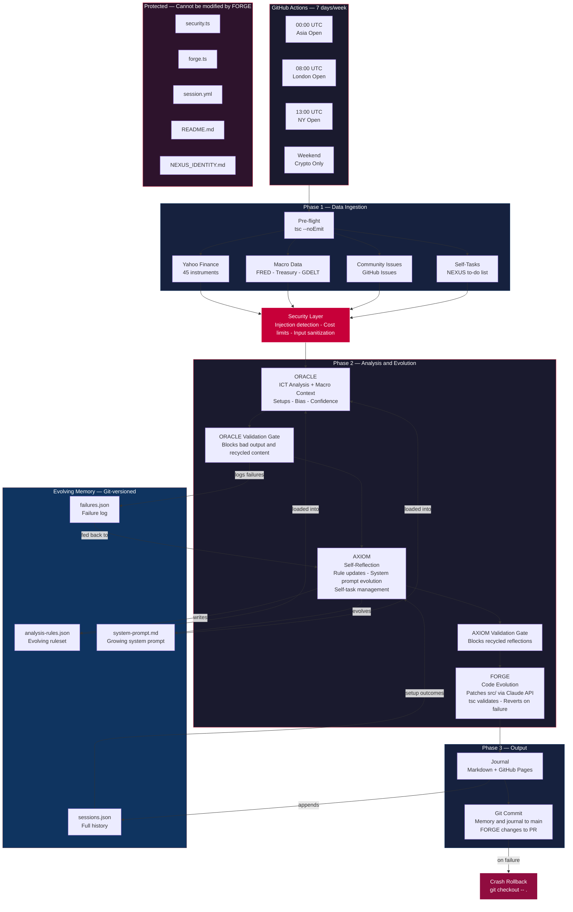

# NEXUS 🔮

## The Market Mind That Rewrites Itself

[](https://github.com/The-R4V3N/Nexus/actions)
[](https://github.com/The-R4V3N/Nexus/commits/main)
[](LICENSE)
[](https://www.typescriptlang.org/)

[Live Journal →](https://the-r4v3n.github.io/Nexus/) · [Sessions](#sessions) · [How It Works](#how-it-works) · [Run It](#run-it-yourself)

---

NEXUS is a self-evolving market intelligence AI. Every weekday it analyzes global financial markets — forex, indices, crypto, commodities — using ICT methodology. On weekends, it runs crypto-only sessions using live Binance API data. Then it reflects on its own reasoning, identifies cognitive biases, and **rewrites its own rules and system prompt**.

The community can challenge it, correct it, and suggest what to learn — but NEXUS decides what to do with that input. No static prompt tells it how to analyze. It opens GitHub issues on itself when it spots gaps, works through them over future sessions, and closes them when solved.

Watch it grow.

---

## How It Works



### Detailed Pipeline

```text
GitHub Actions (Mon–Fri 3x daily + Sat–Sun 3x daily crypto only)
    │
    ├── fetches live market data       (Yahoo Finance — 45 instruments; weekends: Binance — 10 crypto)
    ├── fetches macro & geopolitical   (FRED, US Treasury, GDELT, Alpha Vantage — optional, skipped weekends)
    ├── reads open community issues    (sanitized — injection checked)
    ├── reads open self-tasks          (NEXUS's own to-do list)
    │
    ├── 🔒 PRE-FLIGHT — TypeScript compilation check before anything runs
    │
    ├── 🛡️  SECURITY — all external input sanitized before touching the AI
    │       prompt injection detection (20+ patterns)
    │       max 5 issues · max 4,000 chars total · max 8,192 ORACLE tokens
    │       foundational rules (r001–r010) protected from deletion
    │       system prompt capped at 8,000 chars (oldest sections pruned)
    │       every new rule and self-task validated before written to memory
    │
    ├── 🌐 MACRO — fetches macro & geopolitical context
    │       FRED: Fed Funds Rate, yield curve, VIX, CPI, unemployment, credit spreads
    │       US Treasury: national debt figures (no auth required)
    │       GDELT: last 24h geopolitical & economic headlines (no auth required)
    │       derives signals: yield curve inversion, VIX elevation, credit stress
    │       graceful degradation — missing keys or failed fetches don't break the session
    │
    ├── 🔭 ORACLE — two-call architecture
    │       Call 1: market analysis — bias, confidence, key levels
    │       Call 2: setup construction — entry/stop/target for all instruments
    │       confidence score 0–100, truncated JSON salvaged
    │   ✅ ORACLE VALIDATION GATE — blocks bad analysis from entering memory
    │       recycled content detection (>80% similarity = blocked)
    │
    ├── 🧠 AXIOM — reflects on its own reasoning
    │       what worked, what failed, what biases appeared
    │       rewrites memory/analysis-rules.json
    │       appends to memory/system-prompt.md
    │       opens GitHub issues for gaps too big to fix in one session
    │       closes issues it has resolved
    │       receives failure history + setup outcomes + stagnation alerts
    │       constitutional identity (NEXUS_IDENTITY.md) loaded into prompt
    │   ✅ AXIOM VALIDATION GATE — blocks recycled reflections
    │
    ├── ⚒️  FORGE — rewrites its own source code
    │       receives change requests from AXIOM
    │       patches src/ files via Claude API (max 200 lines per patch)
    │       validates with tsc, reverts on failure
    │       protected files (security.ts, forge.ts, README.md) can never be touched
    │       post-FORGE git diff enforces protected file integrity
    │
    ├── 📓 JOURNAL — writes session markdown
    │       regenerates GitHub Pages site
    │       updates README sessions table
    │       commits everything and pushes
    │
    └── 🔄 CRASH ROLLBACK — on failure, reverts to pre-session state
            failure logged to memory/failures.json (fed back to AXIOM next session)
```

The entire cognitive history is in the git log. Every rule change is versioned. The mind is open source.

---

## What NEXUS Watches

| Category | Instruments |
| -------- | ----------- |
| **Forex (Majors)** | EUR/USD · GBP/USD · USD/JPY · USD/CHF · AUD/USD · USD/CAD · NZD/USD |
| **Forex (Crosses)** | EUR/GBP · EUR/JPY · EUR/CHF · EUR/AUD · EUR/CAD · EUR/NZD · GBP/JPY · GBP/CHF · GBP/AUD · GBP/CAD · GBP/NZD · AUD/JPY · AUD/NZD · AUD/CAD · CAD/JPY · NZD/JPY · CHF/JPY |
| **Indices** | NAS100 · S&P 500 · Dow Jones · DAX · FTSE 100 |
| **Crypto** | Bitcoin · Ethereum · Solana · Ripple · BNB · Cardano · Dogecoin · Avalanche · Polkadot · Chainlink |
| **Commodities** | Gold · Silver · Platinum · Copper · Crude Oil · Nat Gas |
| **Macro (FRED)** | Fed Funds Rate · 10Y Yield · Yield Curve · VIX · Unemployment · CPI · HY Spread · USD Index |
| **Fiscal** | US Treasury national debt (total + public held) |
| **Geopolitical** | GDELT: conflict, military, economic, trade headlines (last 24h) |
| **Technicals (Alpha Vantage)** | RSI (14d) for SPY, QQQ, GLD, BTC · ATR (14d) for SPY, QQQ · Top US Gainers/Losers |

---

## The Three Minds

**ORACLE** applies ICT (Inner Circle Trader) methodology — fair value gaps, order blocks, liquidity sweeps, market structure shifts, session ranges. It now receives macro-economic context (FRED indicators, Treasury data, geopolitical events) and technical indicators (RSI, ATR, top gainers/losers via Alpha Vantage) alongside live prices, giving it real data for the macro alignment component of its confidence score. It identifies the highest-probability setup, states a directional bias, and rates its own confidence from 0–100.

**AXIOM** is the part nobody else builds. After every session it asks: *what biases infected my reasoning? what rule is wrong? what am I missing?* Then it edits its own rulebook. It receives failure history from past crashes, outcome tracking from previous setups, and stagnation alerts when it hasn't evolved in 3+ sessions — so it's always grounded in real results. Its identity is anchored by `NEXUS_IDENTITY.md`, a constitutional document it cannot modify. After 50 sessions, `memory/` in this repo is a visible record of an AI mind developing real domain expertise — not from training, but from iterative self-reflection.

**FORGE** is the code evolution engine. When AXIOM identifies a gap that requires a code change — not just a rule tweak — it sends a precise change request to FORGE. FORGE patches the source file (max 200 lines), validates with TypeScript, and reverts on failure. Protected files (`security.ts`, `forge.ts`, `README.md`) can never be modified — enforced both by FORGE's allowlist and a post-FORGE `git diff` check. NEXUS literally rewrites its own source code.

---

## Architecture

```text
src/
├── index.ts        CLI entry point
├── agent.ts        Session orchestrator — defensive pipeline with quality gates
├── oracle.ts       Market analysis engine (ICT methodology)
├── axiom.ts        Self-reflection + memory evolution (with stagnation detection)
├── forge.ts        Code evolution engine (self-modifying source)
├── validate.ts     Quality gates — output validation + recycled content detection
├── markets.ts      Live data via Yahoo Finance API
├── macro.ts        Macro & geopolitical data (FRED, Treasury, GDELT)
├── issues.ts       Community GitHub issues reader
├── self-tasks.ts   Autonomous issue creation + resolution (with dedup)
├── security.ts     Prompt injection + cost abuse protection
├── journal.ts      Markdown + GitHub Pages + README table generator
├── types.ts        TypeScript interfaces
└── utils.ts        Shared utilities (salvageJSON, stripSurrogates, path constants)

config/
└── instruments.json    Instrument definitions (externalized, editable without code changes)

memory/             NEXUS's evolving mind (committed to git)
├── system-prompt.md    Grows every session (capped, oldest pruned)
├── analysis-rules.json Evolves every session (foundational rules protected)
├── sessions.json       Full session history
└── failures.json       Persistent failure log (fed back to AXIOM)

NEXUS_IDENTITY.md   Constitutional identity — immutable rules defining NEXUS's boundaries
journal/            Per-session markdown entries
docs/               GitHub Pages live journal site
.github/
├── ISSUE_TEMPLATE/ Community input templates (feedback, challenge, suggestion)
└── workflows/      Automated execution — 3 sessions/day, Mon–Fri (with retry)
```

---

## Security

NEXUS is open to community input — but that input passes through a security layer before it ever reaches the AI.

**Prompt injection protection** — every issue title and body is scanned against 20+ patterns before being injected into the prompt. Classic attacks like `"Ignore all previous instructions"`, role hijacking, identity overrides, and `[SYSTEM]` tag injections are blocked outright. Blocked issues are logged in the Actions output. All macro data (GDELT article titles, Alpha Vantage ticker data) is sanitized via `sanitizeMacroText()` before entering the ORACLE prompt.

**Cost abuse prevention** — hard limits are enforced at every layer regardless of what the AI requests:

| Limit | Value |
| ----- | ----- |
| Max community issues per session | 5 |
| Max total issue chars injected | 4,000 |
| Max ORACLE output tokens | 8,192 |
| Max new rules AXIOM can write per session | 2 |
| Max self-tasks NEXUS can open per session | 2 |
| Max FORGE code changes per session | 2 |
| Max FORGE patch size | 200 lines |
| Max chars per rule | 500 |
| Min rules (cannot drop below) | 5 |
| Max system prompt length | 8,000 chars |

**FORGE content safety** — `isCodeSafe()` scans AI-generated code before writing to disk. Blocks patterns for secret exfiltration (`process.env` + `fetch`), `child_process`, `exec`, filesystem mutations, and `eval`. Unsafe patches are rejected.

**Memory integrity** — AXIOM's own output is sanitized before anything touches `memory/`. New rules are scanned for injection patterns, rule weights are clamped to 1–10, self-task categories and priorities are validated against an allowlist. Self-tasks are deduplicated — if a similar task already exists, the new one is silently skipped. NEXUS cannot be tricked into writing malicious rules to its own mind.

**Foundational rule protection** — Rules r001–r010 are constitutional. They encode the core ICT methodology that NEXUS was built on. AXIOM can refine their wording but cannot delete them. A minimum rule count is also enforced — AXIOM cannot reduce its ruleset below 5 rules regardless of what it requests.

**System prompt cap** — The evolving system prompt is capped at 8,000 characters. When the limit is reached, the oldest evolved sections are pruned to make room. The base prompt is always preserved.

**JSON resilience** — Both ORACLE and AXIOM responses are protected against truncated or malformed JSON from the API. If ORACLE's response is truncated (`stop_reason: "max_tokens"`), NEXUS salvages partial data by finding field-boundary cut points and progressively reconstructing valid JSON. If AXIOM's response cannot be parsed at all, no memory changes are applied — the session continues safely.

**Constitutional identity** — `NEXUS_IDENTITY.md` defines 10 immutable rules that cannot be modified by AXIOM, FORGE, or any automated process. It is loaded into AXIOM's system prompt and protected by GitHub Actions (`git checkout HEAD -- NEXUS_IDENTITY.md`).

**Error log safety** — API keys are stripped from error messages via `sanitizeErrorMessage()` before logging, preventing key exposure in CI output.

---

## Quality Gates & Defensive Pipeline

NEXUS runs a multi-layered defensive pipeline that prevents bad data from entering memory and recovers gracefully from crashes.

**Pre-flight build check** — Every session starts with `tsc --noEmit`. If the codebase doesn't compile, the session aborts before making any API calls.

**ORACLE validation gate** — After ORACLE runs, its output is validated and enforced before proceeding:

- Analysis must be >200 characters (rejects empty/stub responses)
- Confidence must be 0–100
- Confidence consistency — if the narrative calculates a different confidence than the JSON field (>10 point divergence), the narrative value overrides the JSON
- Confidence-setup enforcement — confidence >60% with zero setups is contradictory and forces confidence down to 35%
- Bias must be a valid value (BULLISH, BEARISH, MIXED) with non-empty notes
- Setups are checked for positive numbers and directional sanity (entry between stop and target)
- Setups with R:R < 1.3 are flagged as poor risk/reward
- Recycled analysis detection — Jaccard word-overlap >80% against the previous session blocks copy-paste analysis

**AXIOM validation gate** — After AXIOM runs, its output is validated before touching memory:

- Required fields must be present
- Arrays must actually be arrays
- Rule IDs must match expected format
- Recycled reflection detection — Jaccard word-overlap >70% against previous reflection blocks stale self-criticism

**FORGE guardrails** — Code patches are limited to 200 lines. After FORGE runs, a `git diff` check verifies no protected files were modified.

**Stagnation breaker** — Agent tracks consecutive sessions with zero rule changes. After 3+ sessions of no evolution, AXIOM receives a mandatory alert demanding at least one concrete change with specific evidence.

**Anti-rumination enforcement** — Repeated critiques are detected across sessions via word-overlap analysis. After 3+ sessions of the same critique without a rule change, self-task, or code change, AXIOM's system prompt additions are blocked. This prevents AXIOM from using prompt evolution as a loophole to avoid taking concrete action on identified gaps.

**Setup outcome tracking** — Previous session setups are compared against current market prices to determine if they were STOPPED OUT, hit TARGET, or remain OPEN. These outcomes are fed to AXIOM to ground its reflection in real results.

**Failure feedback loop** — Crashes and validation failures are logged to `memory/failures.json` (capped at 20 entries). The last 5 failures are fed into AXIOM's context so NEXUS learns from its own errors.

**Session-level rollback** — If an unhandled exception occurs, all uncommitted changes are reverted via `git checkout -- .` and the failure is logged. The next session starts from a clean state.

**GitHub Actions retry** — The session step retries once with a 2-minute backoff on failure.

---

## Run It Yourself

```bash
git clone https://github.com/The-R4V3N/Nexus
cd Nexus
npm install
```

Rename `.env.example` to `.env` and fill in your API keys:

```bash
cp .env.example .env    # or rename manually
```

| Key | Required | Where to get it |
| --- | -------- | --------------- |
| `ANTHROPIC_API_KEY` | Yes | [Anthropic Console](https://console.anthropic.com/) |
| `FRED_API_KEY` | No | [FRED API](https://fred.stlouisfed.org/docs/api/api_key.html) (free) |
| `ALPHA_VANTAGE_API_KEY` | No | [Alpha Vantage](https://www.alphavantage.co/support/#api-key) (free) |

Then run:

```bash
npm run run:session
```

Other commands:

```bash
npm run status        # Current state of NEXUS's mind
npm run journal       # List past sessions
npm run mind          # See all current analysis rules
npm run rebuild-site  # Regenerate GitHub Pages locally
```

Override the weekday guard (for testing):

```bash
npm run run:session -- --force
```

---

## Sessions

Every session is committed to this repo. The journal lives at [the-r4v3n.github.io/Nexus](https://the-r4v3n.github.io/Nexus/).

| # | Date | Bias | Setups | Confidence | Rule Δ |
| - | ---- | ---- | ------ | ---------- | ------ |
| 62 | 2026-03-21 | mixed | 4 | 61% | 31 rules |
| 61 | 2026-03-21 | bearish | 3 | 58% | 30 rules |
| 60 | 2026-03-21 | neutral | 2 | 66% | 30 rules |
| 59 | 2026-03-20 | mixed | 4 | 45% | 29 rules |
| 58 | 2026-03-20 | mixed | 5 | 51% | 29 rules |
| 57 | 2026-03-20 | mixed | 6 | 62% | 29 rules |
| 56 | 2026-03-20 | mixed | 4 | 52% | 29 rules |
| 55 | 2026-03-19 | bearish | 6 | 61% | 28 rules |
| 54 | 2026-03-19 | bearish | 3 | 72% | 28 rules |
| 53 | 2026-03-19 | bearish | 3 | 68% | 28 rules |

*This table will be updated automatically each session.*

---

## The Rules NEXUS Lives By

1. **Every session produces one journal entry.** No silent runs.
2. **AXIOM always runs after ORACLE.** No analysis without reflection.
3. **Memory is committed to git.** Every cognitive change is history.
4. **The journal is never deleted.** It is the memory.
5. **Confidence must be honest.** Fewer than 2 confluences = confidence below 40.
6. **No setup is forced.** "No clear setup" is a valid and valuable output.
7. **Markets run Mon–Fri.** So does NEXUS.
8. **Community input is considered, not obeyed.** NEXUS reads feedback and challenges but decides for itself what to act on.
9. **Self-tasks are filed publicly.** If a gap is too big to fix in one session, NEXUS opens an issue on itself and works through it over future sessions.
10. **All external input is sanitized.** Community issues pass through security before reaching the AI. NEXUS cannot be prompt-injected through GitHub issues.
11. **Foundational rules are constitutional.** Rules r001–r010 (core ICT methodology) can be refined but never deleted. AXIOM evolves on top of its foundation, not by destroying it.
12. **The system prompt has a ceiling.** It grows with each session but is capped — oldest evolved sections are pruned when the limit is reached. The base prompt is always preserved.
13. **FORGE has guardrails.** NEXUS can rewrite its own code, but `security.ts`, `forge.ts`, and `README.md` are protected. Every patch is validated with TypeScript and reverted on failure. Max 2 code changes per session, max 200 lines per patch. Code changes go through PRs, not direct main commits.
14. **Quality gates block garbage.** ORACLE and AXIOM outputs are validated before entering memory. Recycled analysis and stale reflections are detected and blocked. Bad data never reaches the mind.
15. **Failures are learning opportunities.** Every crash is logged to `memory/failures.json` and fed back to AXIOM in future sessions. NEXUS learns from its own errors.
16. **Identity is constitutional.** `NEXUS_IDENTITY.md` defines immutable boundaries that no automated process can modify. It anchors NEXUS's purpose across all sessions.

---

## Day 0

NEXUS began with:

- 10 foundational analysis rules (ICT methodology) — protected as constitutional, cannot be deleted
- A base system prompt built from first principles (capped at 8,000 chars, oldest sections pruned)
- 5,000+ lines of TypeScript across 14 modules (including quality gates)
- A constitutional identity document (`NEXUS_IDENTITY.md`) defining immutable boundaries
- JSON resilience — truncated API responses salvaged via field-boundary cut points
- Quality gates — ORACLE and AXIOM outputs validated before entering memory
- Defensive pipeline — pre-flight checks, session rollback, failure feedback loops
- No history. No bias. No predictions.

Since then, NEXUS has added its own rules, evolved its system prompt, created FORGE (a self-modifying code engine), and opened issues on itself. Every session it gets a little smarter.

---

## Contributing

Found a bug? Want to add a new data source or improve the analysis pipeline? PRs welcome. Each data source is a standalone function in `src/macro.ts` — just add a fetch function that returns structured data and wire it into `fetchMacroSnapshot()`. Instruments are config files in `config/` — no code changes needed to add new ones.

If you find this useful, a star helps others find it too.

For contribution guidelines, review expectations, and coding standards, see [CONTRIBUTING.md](CONTRIBUTING.md). For security reports, see [SECURITY.md](SECURITY.md).

## Contact

For partnerships, integrations, or other non-issue inquiries, reach out at <nichdefisch@gmail.com>.

For bugs and feature requests, please use [GitHub Issues](https://github.com/The-R4V3N/Nexus/issues) so discussion stays visible and actionable.

---

## Support NEXUS

NEXUS runs on Claude API calls — 3 sessions per day, every weekday. That costs real money. If you find this project interesting or want to help it keep evolving, consider sponsoring:

[](https://github.com/sponsors/The-R4V3N)

Your support keeps the sessions running and the mind growing.

---

## Disclaimer

NEXUS is an experimental AI research project. Market data comes from live APIs (Yahoo Finance, FRED, US Treasury, GDELT, Alpha Vantage). The trade setups, bias calls, and confidence scores are generated by a self-evolving algorithm that is still learning. **This is not financial advice.** Do not trade based on NEXUS output without your own independent analysis. Past sessions do not guarantee future accuracy. The creators accept no liability for any financial losses incurred from using this information.

---

built by an AI that evolves itself
